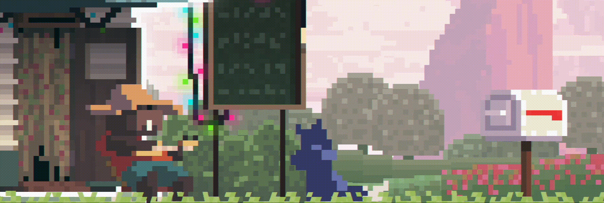

<!-- Introduction -->

  

<!-- Summer Catchers GIF -->

  

<!-- "Glassmorphic" Text Banner -->
<!--

  

-->

<!-- GitHub Readme Streak Stats -->
<!--

  

-->

<!-- GitHub Readme Stats -->
<!--

  

-->

<!-- Tech Stack Matrix -->
<!--
| Layer | Technologies & Frameworks |
| :--- | :--- |
| **Primary Engine** | Unity Engine |
| **Languages** | C# |
| **Systems & Architecture** | Core Subsystems, ECS, Memory Management |
| **Environment** | macOS, Ghostty, Claude Code / CLI Agents |
-->

<!-- Shields.io Badges -->
<!--

  
  
  
  
  

-->

<!-- Skill Icons grid -->
<!--

  

-->
